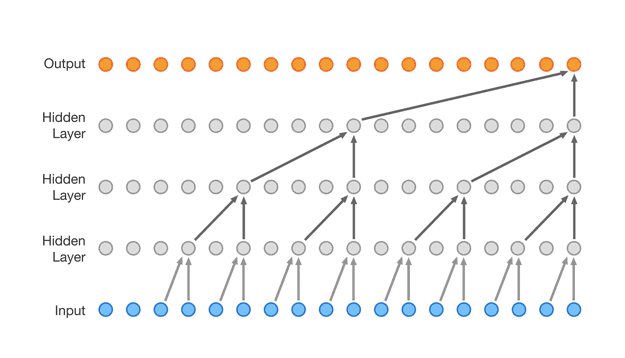

<a name="readme-top"></a>


<!-- PROJECT LOGO -->
<div align="center">


  <h2 align="center">
    WaveNet
  </h2>
</div>


<div>
<div align="center">
    
</div>

<br/>
<br/>

Basic implementation of the wavenet model, for text inference.
<br/>
Based on the [Wavenet: A Generative Model for Raw Audio](https://arxiv.org/pdf/1609.03499.pdf) paper.
<br/>
Convolution without residual connections.
<br/>
Model can generate approximately similar terms.
<br/>


Example name generation:
<br/>
_Paulee_
<br/>
_Levi_
<br/>
_Kennin_
<br/>
_Ry_


<!-- GETTING STARTED -->

## Usage

Clone the repo
   ```sh
   git clone https://github.com/ryansereno/wavenet
   ```
Run
   ```sh
   python model.py
   ```

<p align="right">(<a href="#readme-top">back to top</a>)</p>


